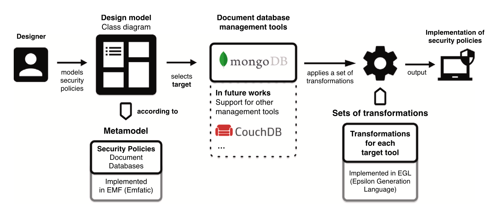
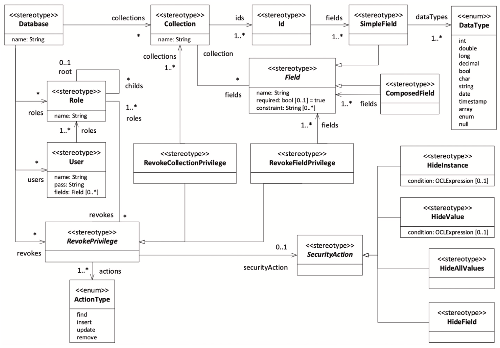
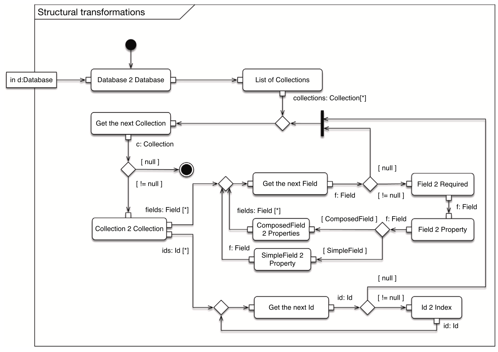
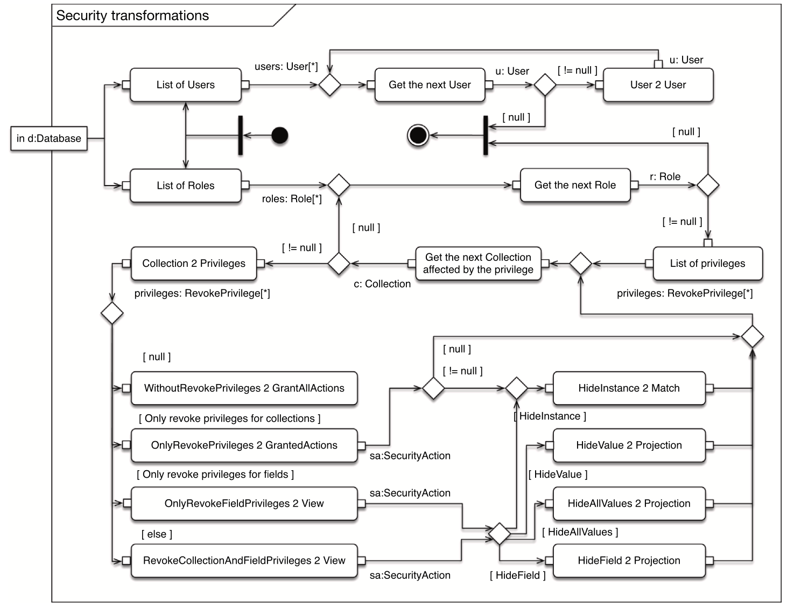

# NoSQL-document-databases

A proposal for the design and implementation of security policies in document databases. 

We first follow the concept of security by design in order to propose a metamodel that allows the specification of both the structure and the security policies required for document databases. We also define an implementation model by analysing the implementation features provided by a specific NoSQL document database management system (MongoDB). 

Having obtained the design and implementation models, we follow the model-driven development philosophy and propose a set of transformation rules that allow the automatic generation of the final implementation of security policies. 

We additionally provide a technological solution in which the Eclipse Modelling Framework environment is employed in order to implement both the design metamodel (Emfatic) and the transformations (Epsilon, EGL). 

Finally, we apply the proposed framework to a case study carried out in the airport domain. This proposal, in addition to saving development time and costs, generates more robust solutions by considering security by design. This, therefore, abstracting the designer from both specific aspects of the target tool and having to choose the best strategies for the implementation of security policies.

